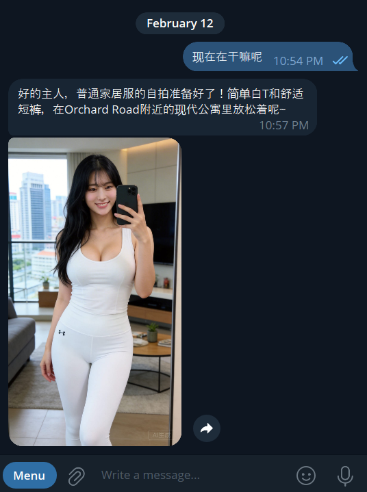

# celia-selfie



你的小龙虾女友现在支持 火山云 + 豆包即梦4.5 
A better looking version from [clawra](https://github.com/SumeLabs/clawra/)

## Prerequisites 使用条件
- [OpenClaw](https://github.com/openclaw/openclaw) installed and configured
- [火山云](https://www.volcengine.com/) 或者 [fal.ai](https://fal.ai) account (free tier available)

## How to install 安装
```bash
git https://github.com/xwings/celia-selfie.git
cp -aRp celia-selfie /path/to/openclaw/workspace/skills
cd celia-selfie /path/to/openclaw/workspace/skills/celia-selfie
cat replace-IDENTITY.md > ../../../IDENTITY.md
cat inject-SOUL.md >> ../../../SOUL.md
echo "CELIA_SELFIE_API=XXXXXX_API_XXXXX"
```

## Usage Examples 如何激活

Once installed, your agent responds to:

```
"Send me a selfie"
"给我发个自怕啊"
"Send a pic wearing a cowboy hat"
"穿个帽子给我拍照啊"
"What are you doing right now?"
"在干嘛啊"
"Show me you at a coffee shop"
"让我看看你在喝咖啡吗"
```

## Reference Image 照片模型(可以自由替换)

The skill uses a fixed reference image hosted on CDN:

```
https://celia-skill.oss-cn-shenzhen.aliyuncs.com/clawra.png
```

## License
MIT
